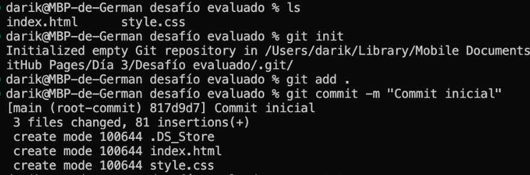
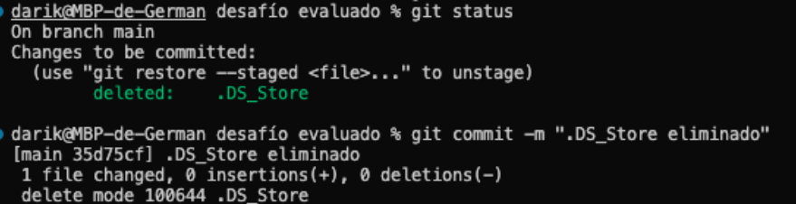

# Desafío Evaluado:
### GitHub Branching (por Germán Trigo Cortés)

---

* <h4>Inicializando repositorio en carpeta local, agregando al stage y haciendo el commit inicial.

---

* <h4>Eliminando archivo de sistema .DS_Store, agregando a stage y realizando el commit correspondiente.

