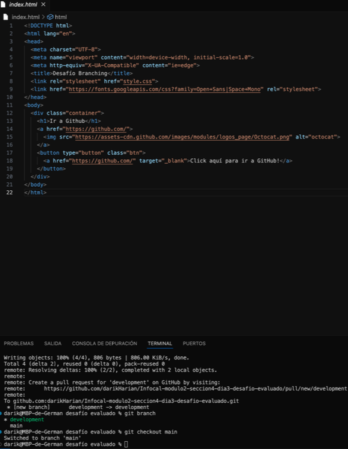

# Desafío Evaluado:
### GitHub Branching (por Germán Trigo Cortés)

---

* <h4>Inicializando repositorio en carpeta local, agregando al stage y haciendo el commit inicial.

---

* <h4>Eliminando archivo de sistema .DS_Store, agregando a stage y realizando el commit correspondiente.

---

* <h4>Agregando repositorio remoto y realizando push a la rama main.

---

* <h4>Creando la rama "development" y eligiéndola para realizar cambios en la nueva rama creada.

---

* <h4>Realizando cambios a los archivos index.html y style.css, agregando archivos modificados al stage, creando commit y realizando push a la rama "Development".

---

* <h4>Cambiando a la rama "main" para revisar que no se hayan hecho cambios en los archivos, realizando el merge de la rama "development" en "main" y realizando el push al repositorio remoto "main".

 

---

* <h4>Habilitando GitHub Pages en el proyecto
* Link del proyecto: <a href="https://github.com/darikHarian/classroom-infocal/tree/main/modulo2/seccion4/dia3/desafioEvaluado">darikHarian/Infocal-modulo2-seccion4-dia3-desafio-evaluado
* Link de GitHub Pages: <a href="https://darikharian.github.io/classroom-infocal/modulo2/seccion4/dia3/desafioEvaluado/">Desafío Branching

